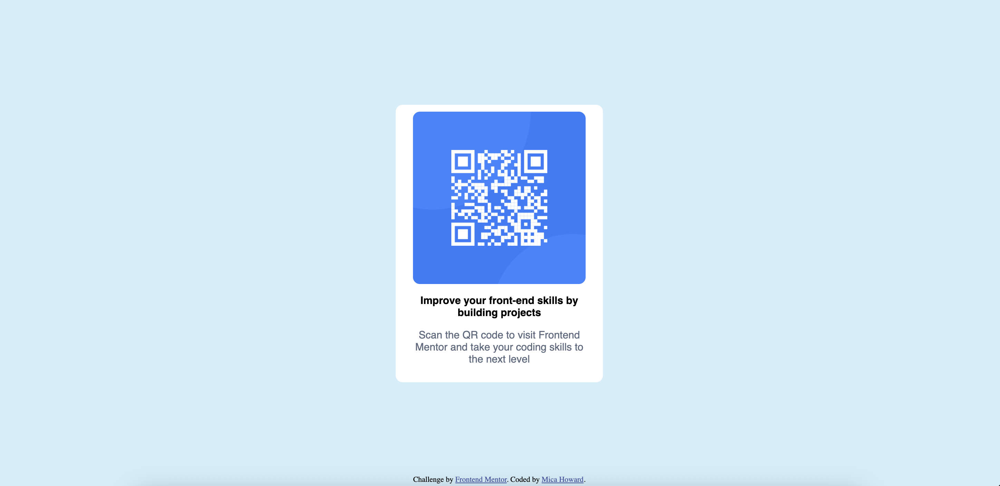
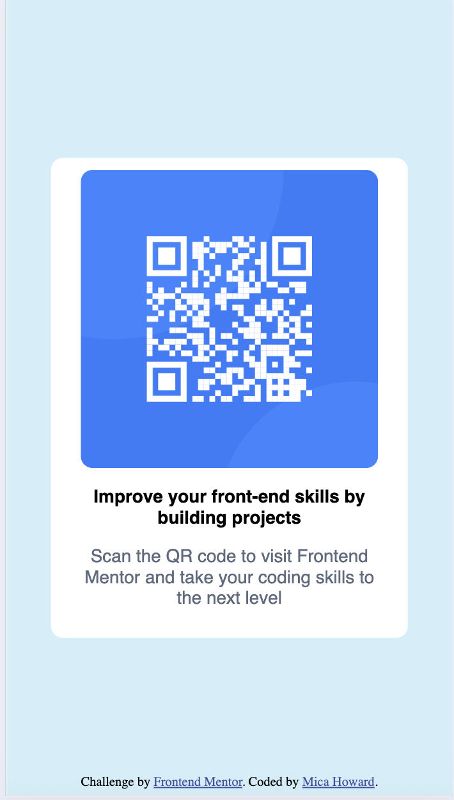

## Table of contents

- [Overview](#overview)
  - [Screenshot](#screenshot)
  - [Links](#links)
- [My process](#my-process)
  - [Built with](#built-with)
  - [What I learned](#what-i-learned)
  - [Continued development](#continued-development)
  - [Useful resources](#useful-resources)
- [Author](#author)

## Overview

My project is a QR code built using HTML & CSS. It is responsive for both desktop and mobile.

### Screenshot

<ins> Desktop </ins>

<ins> Mobile </ins>

### Links

- Solution URL: [Github code](https://github.com/mica-lwe/qr-code)
- Live Site URL: [Github Pages](https://mica-lwe.github.io/qr-code/)

## My process

### Built with

- Semantic HTML5 markup
- CSS custom properties
- Flexbox

### What I learned

This project helped reinforce my knowledge of HTML & CSS. I found it useful to practice implementing flexbox on a straightforward project. 

My biggest learning point from this project is to not use set heights and widths for ease of creating a responsive design. As I began the project, I was more focused on the content and styling before responsiveness. It would have been much easier if I'd considered responsiveness as I coded and used alternatives to px.

### Continued development

Continuing on I will be focusing on making responsive designs, in an efficient way. As I'm confident with Flexbox, I'm also going to create more projects using CSS Grid.

### Useful resources

- [Kevin Powell YT](https://www.youtube.com/watch?v=VQraviuwbzU) - This helped me when considering how to make my project responsive.

## Author

- LinkedIn - [Mica Howard](https://www.linkedin.com/in/micahoward/)
- Frontend Mentor - [@mica-lwe](https://www.frontendmentor.io/profile/mica-lwe)
